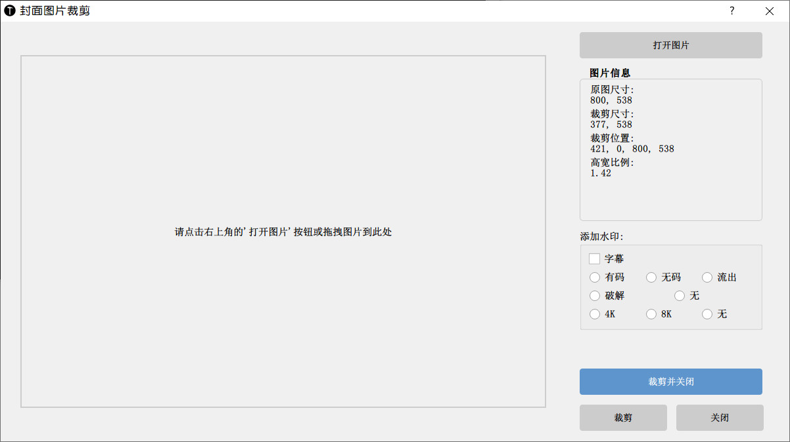

# NFO Tools Collection
## 大锤 NFO.editor GUI版
这是一个用于管理NFO文件的工具集合，提供了三个独立的可执行程序。

## 功能展示

### NFO.Editor.exe (主程序)
这是一个集成了所有功能的主程序：


主要功能：
- 图形化界面编辑NFO文件
- 支持批量修改标题、演员、标签等信息
- 实时预览和编辑封面图片
- 支持文件拖放操作
- 支持快速筛选和排序
- 支持文件移动和整理
- 集成了重命名工具和裁剪工具

### cg_rename.exe (重命名工具)
独立的批量重命名工具，可以单独使用：


功能特点：
- 基于NFO信息自动重命名文件夹
- 支持自定义命名规则
- 支持演员名称统一化
- 支持评分信息整合

### cg_crop.exe (封面裁剪工具)
独立的图片处理工具，可以单独使用：



功能特点：
- 鼠标拖动裁剪视频封面图片
- 支持添加水印
- 支持2:3标准比例裁剪
- 支持批量处理

### cg_dedupe.exe (封面裁剪工具)


## 系统要求

- Windows系统 (支持Windows XP/7/8/10/11)
- 屏幕分辨率：建议1366×768或更高
- 不需要安装Python环境

## 安装说明

1. 下载发布包中的可执行文件
2. 解压到任意目录
3. 直接运行对应的exe文件即可

文件结构：
```
NFO_Tools/
├── NFO.Editor.exe      # 主程序
├── cg_rename.exe       # 重命名工具
├── cg_crop.exe         # 裁剪工具
├── mapping_actor.xml   # 演员映射配置文件（可选）
└── img/               # 水印图片目录
    ├── sub.png
    ├── wuma.png
    ├── leak.png
    └── umr.png
```

## 配置文件

### mapping_actor.xml
用于演员名称映射的配置文件，格式如下：
```xml
<actors>
    <a keyword="name1,name2" zh_cn="标准名称"/>
</actors>
```

配置文件位置：
- 优先使用可执行文件同目录下的mapping_actor.xml
- 如果不存在，则使用程序内置的配置文件

## 使用方法

### NFO.Editor.exe
1. 双击运行NFO.Editor.exe
2. 点击"选择nfo目录"打开要处理的文件夹
3. 使用左侧列表选择要编辑的文件
4. 在右侧面板进行编辑
5. 可以通过顶部按钮调用重命名工具和裁剪工具

快捷操作：
- 双击列表项：打开对应的NFO文件
- 右键点击：显示上下文菜单
- 拖拽文件：支持直接拖拽文件到程序窗口

### cg_rename.exe
1. 双击运行cg_rename.exe
2. 选择要处理的目录
3. 点击"执行"开始重命名

支持的命名格式：
```
演员名 [标题] 评分
例如：ABC [DEF-123] 8.5
```

### cg_crop.exe
1. 双击运行cg_crop.exe
2. 打开要处理的图片
3. 鼠标拖动调整裁剪框位置
4. 选择需要添加的水印
5. 点击"裁剪并关闭"保存

水印选项：
- 字幕水印：添加字幕标识
- 分类水印：无码/有码/破解等
- 支持水印组合

## 注意事项

1. 使用批量重命名功能前建议先备份重要文件
2. 图片裁剪工具支持的图片格式：jpg、jpeg、png、bmp
3. 所有工具都需要保证对工作目录有写入权限
4. 大量文件处理时请耐心等待，不要强制关闭程序

## 更新日志

- v9.1.8: NFO编辑器功能完善
- v1.0.0: 封面裁剪工具发布
- v0.0.3: 批量重命名工具更新

## 问题反馈

如果在使用过程中遇到问题，请通过Issues反馈。

## 许可证

MIT License